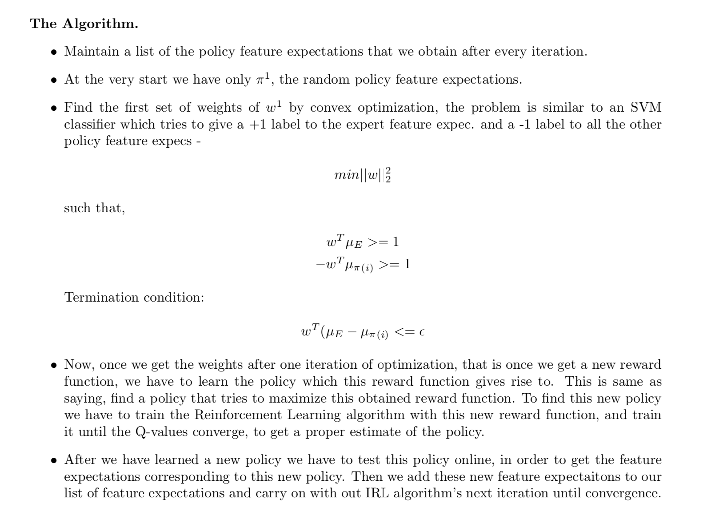

# Apprenticeship learning using Inverse Reinforcement Learning

## Introduction 
Reinforcement learning (RL) is is the very basic and most intuitive form of trial and error learning. Often referred to as learning by exploration, that is by taking random actions initially and then slowly figuring out the actions which lead to the desired motion. In any RL setting, to make the agent perform different behaviors, it is the reward structure that one must modify/exploit. But assume we only have the knowledge of the behavior of the expert with us, then how do we estimate the reward structure given a particular behavior in the environment? This is the problem of Inverse Reinforcement Learning (IRL), where given the optimal/sub-optimal expert policy, we wish to determine the underlying reward structure.

## Setup 
In our case, we assume the actions taken by the humans are sub-optimal and we need the RL agent to take better actions. Apprenticeship Learning via IRL will try to inder the goal of a teacher. It will learn a reward function from observations, which can then be used for reinforcement learning. If it discovers that the goal is to hit a nail with a hammer, it will ignore blinks and scratches from the teacher, as they are irrelevant to the goal.

## How to Run
Run the ```irl_main.py``` file. It contains the main code in which DQN and all the other necessary modules have been called. Once the DQN policy has been trained enough (met the condition of IRL) it will return a ```model.h5``` file which will be our trained policy. We can then load this policy and execute in our environment to calculate the mean and SD of the new reward values we are getting. 


## Agent
An agent is the algorithm which will make the decisions given a set of observations. 

## Sensors
An agent will be equipped with sensing capabilities to collect raw data (409 in our case). 

## State Space
The state of the agent consists of 409 observable features.

## Rewards
The reward after every decision is calculated as a weighted linear combination of the feature values observed in that frame. Here the reward rt in the tth frame, is calculated by the dot product of the weight vector w with the vector of feature values in tth frame, that is the state vector φt. Such that ```rt =wT ∗φt```.

## Inverse RL
- The features or the **basis functions** ```φi``` which are basically observable in the state. We define ```φ(st)``` to be the sum of all the feature expectations ```φi``` such that: ```phi(st) = φ1 + φ2 + ......φn```.
- **Rewards rt** - Linear combination of these feature values observed at each state st. ```r(s,a,s′) = w1φ1 +w2φ2 +...+wnφn = wT ∗φ(st)```.
- ***Feature expectations μ(π)*** of a policy π is the sum of discounted feature values φ(st). ```μ(π) = 􏰂∞t=0 γtφ(st).```
The feature expectations of a policy are independent of weights, they only depend on the state visited during the run (according to the policy) and on the discount factor γ a number between 0 and 1 (e.g. 0.9 in our case). To obtain the feature expectations of a policy we have to execute the policy in real time with the agent and record the states visited and the feature values obtained.

- ***Initialization*** 
  - Expert policy feature expectations or the expert’s feature expectations ```μ(πE)``` are obtained by the actions that are taken according to the expert behavior. We basically execute this policy and get the feature expectations as we do with any other policy. The expert feature expectations are given to the IRL algorithm to find the weights such that the reward funciton corresponding to the weights resemebles the underlying reward function that the expert is trying to maximize (in usual RL language).
  - Random policy feature expectations - execute a random policy and use the feature expectations obtained to initialize IRL.



